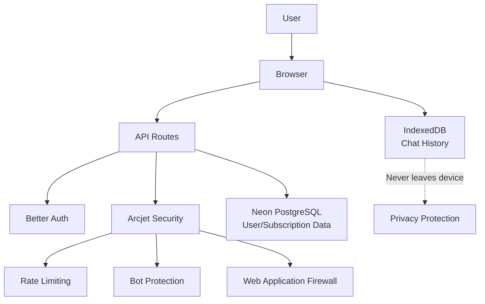
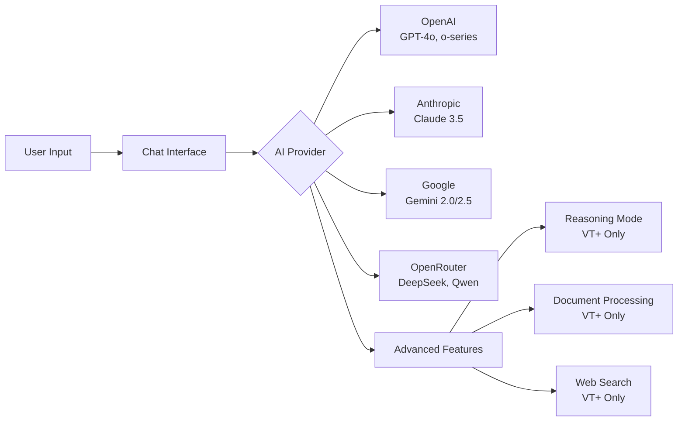
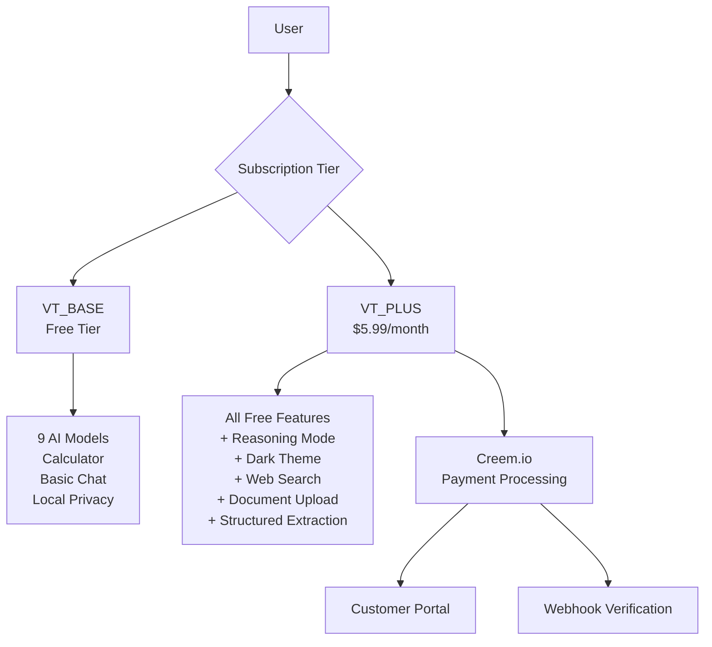
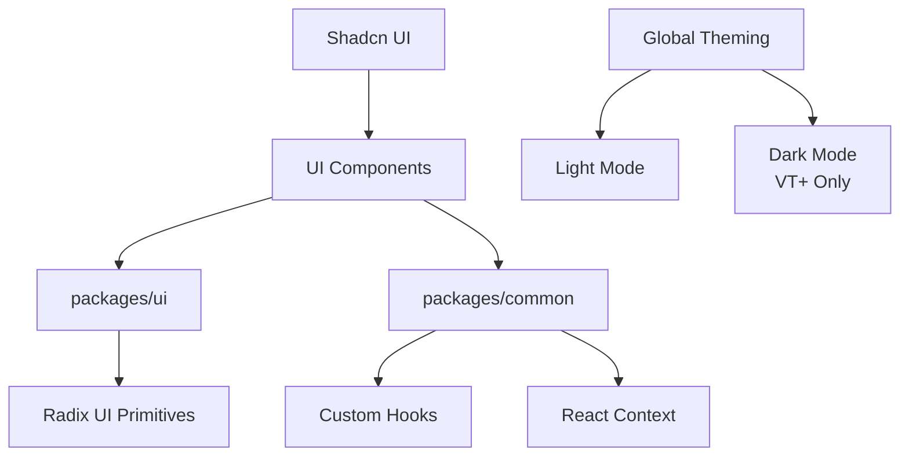
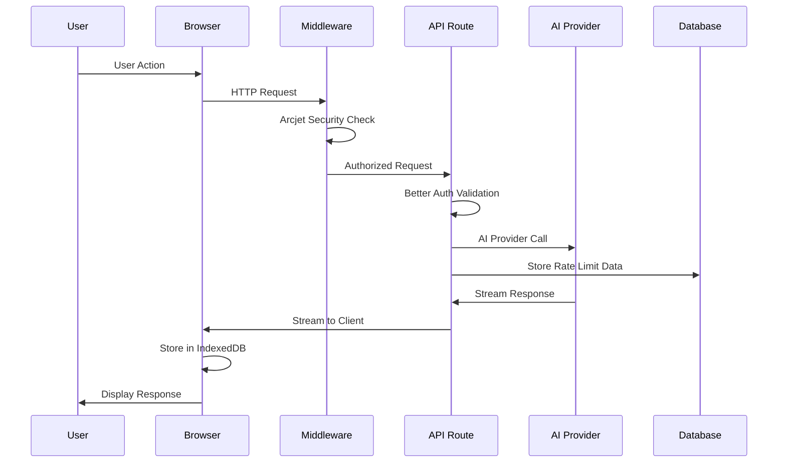
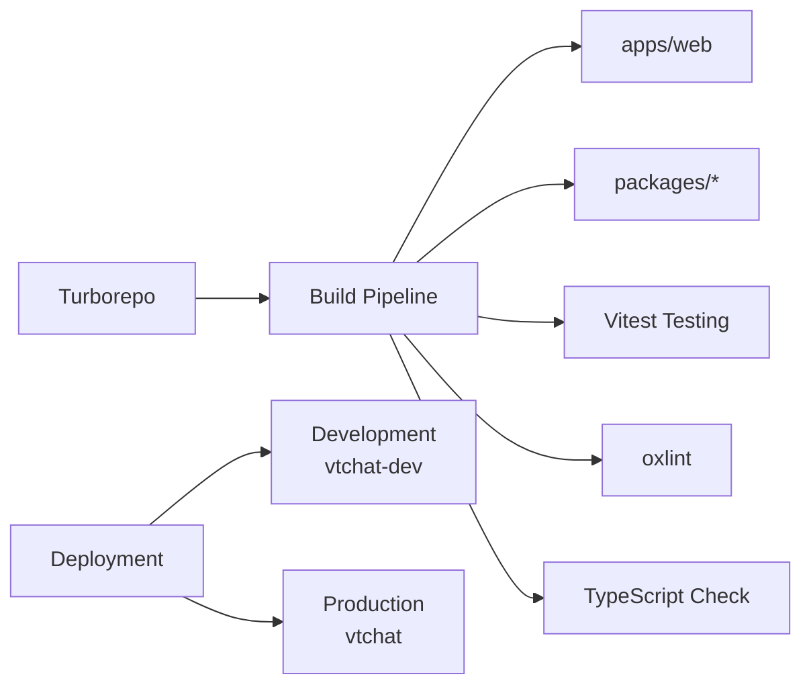
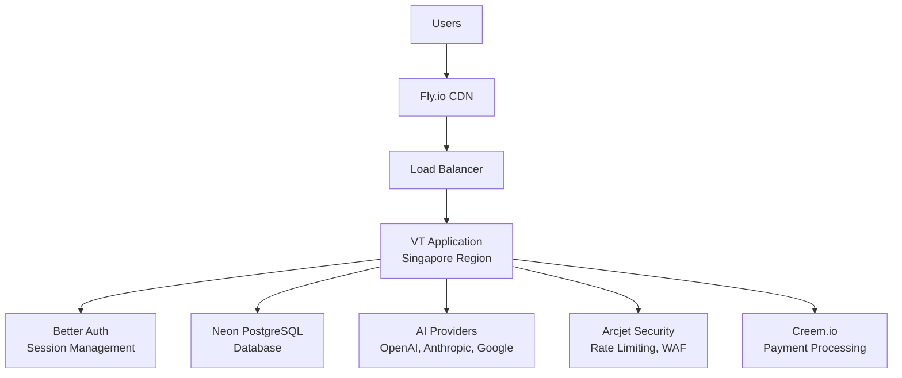

# VT (VTChat) Architecture Overview

## 🏗️ System Architecture

VT is built as a production-ready, privacy-first AI chat application using a modern monorepo architecture with TypeScript, Next.js 15, React 19.0.0, and comprehensive security integrations.

## 📂 Monorepo Structure

### Turborepo Configuration

```
vtchat/
├── apps/
│   └── web/                    # Next.js 15 main application (App Router, React 19)
├── packages/
│   ├── actions/               # Server actions (feedback, forms)
│   ├── ai/                    # AI models, providers, workflow logic
│   ├── common/                # Shared React components, hooks, context
│   ├── orchestrator/          # Workflow engine and task management
│   ├── shared/                # Types, constants, configs, utils, logger
│   ├── tailwind-config/       # Shared Tailwind CSS configuration
│   ├── typescript-config/     # Shared TypeScript configurations
│   └── ui/                    # Base UI components (Shadcn UI)
└── scripts/                   # Utility scripts and automation
```

### Package Dependencies

- **apps/web** → Depends on all packages
- **packages/common** → Uses ui, shared packages
- **packages/ai** → Uses shared, orchestrator packages
- **packages/orchestrator** → Uses shared package
- **packages/ui** → Independent base component library

## 🔧 Technology Stack

### Frontend & Core

- **Framework**: Next.js 15 with App Router, React 19.0.0, and TypeScript
- **Styling**: Tailwind CSS + Shadcn UI design system
- **State Management**: Zustand for global state + React Query for server state
- **UI Components**: Shadcn UI with Radix UI primitives
- **Animations**: Framer Motion for smooth interactions
- **Icons**: Lucide React icon library

### Backend & Infrastructure

- **Runtime**: Bun (JavaScript runtime and package manager)
- **Database**: Neon PostgreSQL with connection pooling
- **ORM**: Drizzle ORM with type-safe operations and migrations
- **Authentication**: Better Auth with session caching (87% performance improvement)
- **Security**: Arcjet protection (rate limiting, bot detection, WAF)
- **Payments**: Creem.io integration with webhook verification
- **Deployment**: Fly.io with Singapore region optimization

### Data Storage

- **Chat Data**: Browser IndexedDB via Dexie.js (local-first, zero server persistence)
- **User Data**: PostgreSQL for accounts, subscriptions, rate limits
- **Session Data**: Better Auth session management
- **File Storage**: Local processing only (documents never stored on server)

## 🛡️ Security Architecture

### Privacy-First Design



### Multi-Layer Security

1. **Application Layer**: Arcjet protection with rate limiting, bot detection, email validation
2. **Authentication Layer**: Better Auth with secure session management
3. **Data Layer**: Local-first storage with IndexedDB, zero server persistence
4. **Transport Layer**: HTTPS enforcement with proper security headers
5. **Infrastructure Layer**: Fly.io with secure deployment and environment separation

## 🤖 AI Integration Architecture

### Multi-Provider Support



### AI SDK Integration

- **Vercel AI SDK**: Core AI integration with reasoning tokens support
- **Streaming**: Real-time response streaming with partial content updates
- **Tool Usage**: Mathematical calculator, document processing, web search
- **Context Management**: Advanced conversation context handling

## 💳 Subscription Architecture

### Two-Tier System



### Feature Gating

- **Dynamic Protection**: Real-time subscription status checking
- **Graceful Degradation**: Clear upgrade prompts for premium features
- **Rate Limiting**: Free tier models limited to 10 requests/day per user

## 🎨 UI/UX Architecture

### Design System



### Component Architecture

- **packages/ui**: Base Shadcn UI components (Button, Input, Dialog, etc.)
- **packages/common**: Application-specific components (ChatMessage, SettingsModal, etc.)
- **Responsive Design**: Mobile-first approach with Tailwind CSS
- **Accessibility**: WCAG compliance with keyboard navigation and screen reader support

## 📊 Data Flow Architecture

### Request Lifecycle



### State Management

- **Zustand**: Global application state (user, subscription, settings)
- **React Query**: Server state management and caching
- **Local Storage**: User preferences and API keys (BYOK)
- **IndexedDB**: Chat history and conversation data (via Dexie.js)

## 🚀 Performance Architecture

### Build Optimization

- **Turbopack**: 87% faster compilation (24s → 3s)
- **Bundle Analysis**: Optimized bundle size (456kB → 436kB)
- **Code Splitting**: Dynamic imports for optimal loading
- **Tree Shaking**: Unused code elimination

### Runtime Performance

- **Auth Caching**: 87% faster session validation
- **Database Optimization**: 70-80% faster queries with proper indexing
- **Streaming**: Real-time AI response streaming
- **Lazy Loading**: Components and routes loaded on demand

## 🔧 Development Architecture

### Build System



### Quality Assurance

- **TypeScript**: Strict configuration with zero errors
- **Testing**: Vitest with Testing Library and comprehensive coverage
- **Linting**: oxlint for fast, modern linting
- **Formatting**: Prettier with Tailwind CSS plugin
- **Type Safety**: End-to-end type safety from database to UI

## 🌐 Deployment Architecture

### Production Infrastructure



### Environment Separation

- **Development**: `vtchat-dev.fly.dev` with cost-optimized resources
- **Production**: `vtchat.io.vn` with auto-scaling and high availability
- **Health Monitoring**: `/api/health` endpoints with 30s intervals
- **Auto-scaling**: Intelligent suspend/resume based on traffic

## 📈 Monitoring & Analytics

### Application Monitoring

- **Health Checks**: Production-ready health endpoints
- **Error Tracking**: Comprehensive error boundaries and logging
- **Performance Metrics**: Real-time performance monitoring
- **Security Events**: Arcjet security event tracking

### Privacy-Safe Analytics

- **Traffic Distribution**: Region-based traffic analysis (no PII)
- **Usage Patterns**: Feature usage analytics (anonymized)
- **Performance Tracking**: Compilation and response time metrics
- **Security Monitoring**: Rate limiting and bot detection metrics

## 🔄 Future Architecture Considerations

### Scalability

- **Multi-Region Deployment**: Global edge distribution
- **Database Scaling**: Read replicas and connection pooling
- **Cache Layer**: Redis for session and application caching
- **Microservices**: Potential service extraction for specialized features

### Enhanced Security

- **End-to-End Encryption**: Enhanced client-side encryption
- **Zero-Knowledge Architecture**: Further privacy enhancements
- **Advanced Threat Detection**: Enhanced security monitoring
- **Compliance**: SOC 2, ISO 27001 consideration

---

This architecture provides a solid foundation for a production-ready, privacy-focused AI chat application with security, performance, and scalability.
