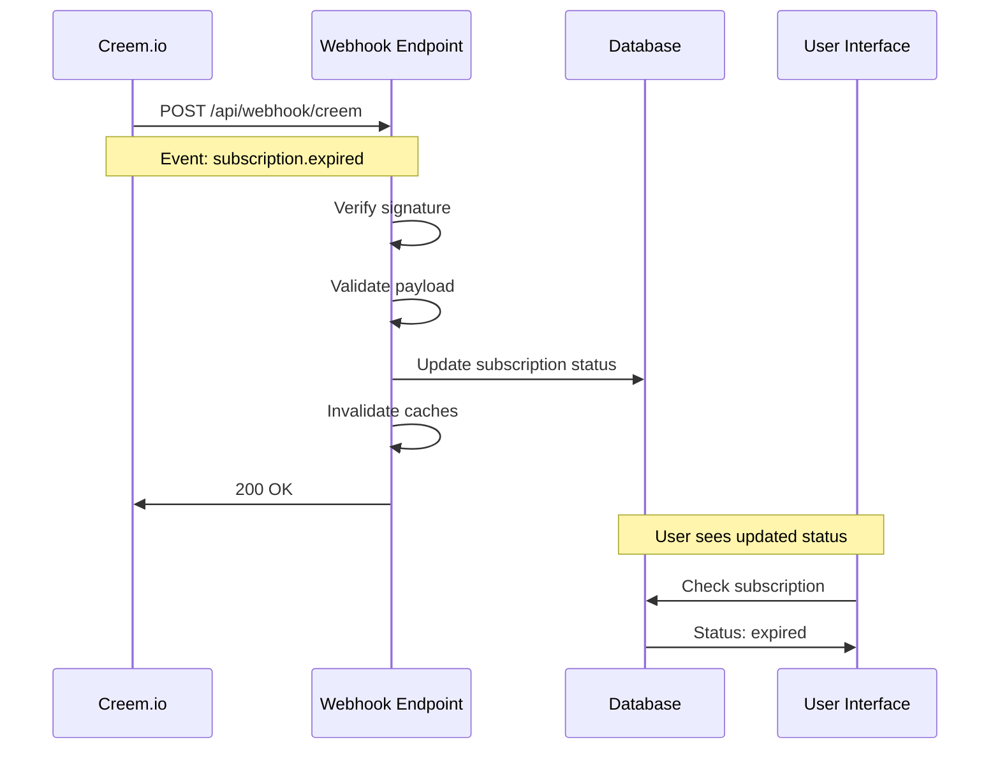

# Creem.io Webhook Setup Guide

This guide explains how to set up and test Creem.io webhooks following their official documentation.

## 📋 Webhook Implementation Checklist

### ✅ 1. Webhook Endpoint Created

- **Location**: `/api/webhook/creem/route.ts`
- **Method**: POST only
- **Framework**: Next.js App Router
- **Status**: ✅ Implemented

### ✅ 2. JSON Payload Handling

- **Body Parsing**: ✅ `await request.text()` → `JSON.parse()`
- **Schema Validation**: ✅ Zod schemas for all event types
- **Error Handling**: ✅ Proper HTTP status codes

### ✅ 3. HTTP 200 OK Response

```typescript
// Success response
return NextResponse.json({ received: true, processed: true }, { status: 200 });
```

### ✅ 4. Signature Verification

```typescript
// HMAC-SHA256 verification as per Creem docs
const computedSignature = crypto.createHmac('sha256', secret).update(payload).digest('hex');
```

### ✅ 5. Environment Configuration

- **Development**: Signature verification optional
- **Production**: Signature verification required
- **Secret**: `CREEM_WEBHOOK_SECRET` environment variable

## 🔗 Webhook URL Endpoints

### Development

```
https://your-ngrok-domain.ngrok.io/api/webhook/creem
```

### Production

```
https://your-production-domain.com/api/webhook/creem
```

## 🎯 Supported Webhook Events

| Event Type              | Status | Description                 |
| ----------------------- | ------ | --------------------------- |
| `checkout.completed`    | ✅     | Creates active subscription |
| `subscription.active`   | ✅     | Activates subscription      |
| `subscription.paid`     | ✅     | Payment received            |
| `subscription.canceled` | ✅     | Subscription cancelled      |
| `subscription.expired`  | ✅     | Subscription expired        |
| `subscription.update`   | ✅     | Subscription updated        |
| `subscription.trialing` | ✅     | Trial period started        |
| `refund.created`        | ✅     | Refund processed            |
| `dispute.created`       | ✅     | Dispute opened              |

## 🔄 Retry Mechanism

Creem automatically retries failed webhooks with this schedule:

- **30 seconds** → First retry
- **1 minute** → Second retry
- **5 minutes** → Third retry
- **1 hour** → Final retry

**Important**: Return HTTP 200 OK to stop retries!

## 🛠️ Development Setup

### 1. Environment Variables

```bash
# .env.local
CREEM_WEBHOOK_SECRET=your_webhook_secret_here
NODE_ENV=development
```

### 2. Local Testing with ngrok

```bash
# Install ngrok
npm install -g ngrok

# Start your Next.js app
bun dev

# In another terminal, expose your local server
ngrok http 3000

# Use the ngrok URL in Creem dashboard
https://abc123.ngrok.io/api/webhook/creem
```

### 3. Register Webhook in Creem Dashboard

1. Go to **Developers** → **Webhooks**
2. Add your webhook URL
3. Select events to receive
4. Save webhook secret

## 🧪 Testing

### Run Tests

```bash
# Test signature verification
bun test apps/web/app/tests/creem-webhook-signature.test.ts

# Test webhook integration
bun test apps/web/app/tests/creem-webhook-integration.test.ts
```

### Manual Testing

```bash
# Test with curl
curl -X POST https://your-domain.com/api/webhook/creem \
  -H "Content-Type: application/json" \
  -H "creem-signature: your_signature_here" \
  -d '{
    "id": "evt_test_123",
    "eventType": "subscription.expired",
    "created_at": 1234567890,
    "object": {
      "id": "sub_123",
      "status": "expired",
      "customer": {
        "id": "cus_123",
        "email": "test@example.com"
      },
      "product": {
        "id": "prod_123",
        "name": "VT+ Monthly"
      },
      "current_period_start_date": "2024-01-01T00:00:00Z",
      "current_period_end_date": "2024-01-31T23:59:59Z"
    }
  }'
```

## 🔍 Debugging

### Check Logs

```bash
# Development logs
bun dev

# Look for webhook events
[Creem Webhook] Received webhook request at /api/webhook/creem
[Creem Webhook] Event processed successfully
```

### Common Issues

**❌ Issue**: 401 Unauthorized
**✅ Solution**: Check `CREEM_WEBHOOK_SECRET` and signature

**❌ Issue**: 400 Bad Request  
**✅ Solution**: Verify JSON payload format

**❌ Issue**: 500 Internal Server Error
**✅ Solution**: Check database connection and user exists

## 🚀 Production Deployment

### 1. Deploy Webhook Endpoint

```bash
# Deploy to production
./deploy-fly.sh

# Verify endpoint is accessible
curl https://your-production-domain.com/api/webhook/creem
```

### 2. Update Creem Dashboard

1. Go to **Live** environment in Creem
2. Update webhook URL to production
3. Test with a live payment

### 3. Monitor Webhooks

- Check application logs
- Monitor webhook delivery in Creem dashboard
- Set up alerts for failed webhooks

## 📊 Integration Flow



## ✅ Verification Checklist

Before going live, verify:

- [ ] Webhook URL is publicly accessible
- [ ] HTTPS is enabled (required by Creem)
- [ ] Signature verification works in production
- [ ] All event types are handled correctly
- [ ] Database updates work properly
- [ ] Cache invalidation occurs
- [ ] Error handling returns appropriate HTTP codes
- [ ] Logs are properly configured

## 📞 Support

If you encounter issues:

1. Check the test files for working examples
2. Review Creem.io webhook documentation
3. Verify environment variables are set correctly
4. Test signature verification independently
5. Check application logs for detailed error messages
