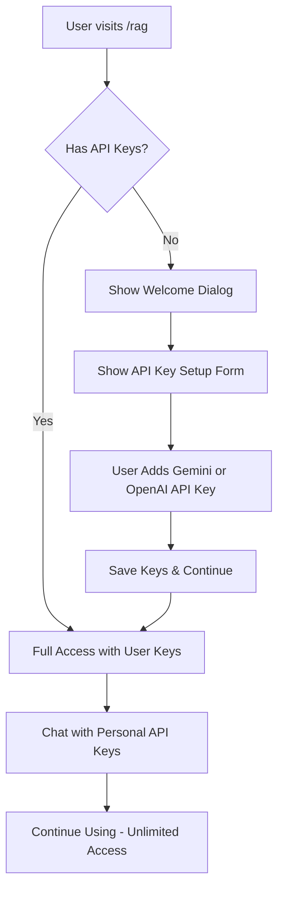

# RAG Onboarding System

## Overview

The RAG (Retrieval-Augmented Generation) onboarding system provides a streamlined setup experience for new users to configure their Knowledge Assistant feature with their own API keys.

## Features

### 1. Welcome Experience
- **Clear Introduction**: Explanation of the Knowledge Assistant capabilities
- **API Key Requirement**: Users must provide their own API keys to use the feature
- **Guided Setup**: Step-by-step API key configuration with helpful links

### 2. BYOK (Bring Your Own Key) System
- **Personal API Keys**: Users provide their own Gemini or OpenAI API keys
- **Unlimited Usage**: No restrictions when using personal API keys
- **Private & Secure**: Complete data privacy with user-owned keys
- **Multiple Providers**: Support for Gemini and OpenAI API keys

## Implementation

### Components

**`RagOnboarding`** (`apps/web/components/rag-onboarding.tsx`)
- Welcome dialog for API key setup
- API key input forms with validation
- Links to API key generation pages
- Success confirmation

**`useRagOnboarding`** (`apps/web/hooks/use-rag-onboarding.ts`)
- Onboarding state control
- API key detection
- Dialog visibility management

### API Integration

The RAG API (`apps/web/app/api/chat/rag/route.ts`) requires:
- **User API Keys**: Users must provide their own Gemini or OpenAI API keys
- **Model Selection**: Users can choose from available models for their API provider
- **Secure Processing**: All conversations use user's own API keys for privacy

### Usage Flow

## Configuration

### Environment Variables
No special environment variables required - the system uses user-provided API keys.

### User Requirements
- **Gemini API Key** (recommended): Free tier available from Google AI Studio
- **OpenAI API Key** (optional): Available from OpenAI Platform
- At least one API key required to use the Knowledge Assistant

## User Experience

### First Visit
1. User navigates to Knowledge Assistant
2. Welcome dialog appears explaining API key requirement
3. User can either:
   - "Skip for Now" - Close dialog, but feature remains unavailable
   - "Add API Keys" - Open API key setup form

### API Key Setup Experience
- **Gemini API Key**: Primary option with direct link to Google AI Studio
- **OpenAI API Key**: Alternative option with link to OpenAI Platform
- Form validation ensures at least one key is provided
- Success feedback confirms setup completion

### Post-Setup Experience
- Full access to Knowledge Assistant features
- Unlimited conversations with personal API keys
- All advanced features unlocked
- No usage restrictions or limits

## Security & Privacy

- **Complete Privacy**: All conversations use user's own API keys
- **No Data Sharing**: VTChat never sees or stores user conversations
- **User Isolation**: Knowledge bases remain completely private
- **Secure Storage**: API keys stored securely in user's browser
- **PII Protection**: All content is processed with automatic PII redaction

## Benefits

### For Users
- **Complete Privacy**: Full control over data and API usage
- **Unlimited Access**: No restrictions when using personal API keys
- **Cost Control**: Users pay their own API providers directly
- **Multiple Providers**: Choice between Gemini and OpenAI

### For Product
- **No API Costs**: Users provide their own API keys
- **Better Privacy**: Enhanced security with BYOK approach
- **Scalable**: No infrastructure costs for API usage
- **Sustainable**: Cost-effective long-term model

## Implementation Details

### State Management
The onboarding system uses minimal state:
- `showOnboarding`: Boolean to control dialog visibility
- `hasApiKeys`: Boolean indicating if user has configured API keys

### API Key Detection
Checks for presence of:
- `GEMINI_API_KEY` in user's API key store
- `OPENAI_API_KEY` in user's API key store

### Dialog Behavior
- Shows automatically when no API keys are detected
- Hides when API keys are successfully added
- Can be dismissed but re-appears until keys are added

## Testing

Test the onboarding flow:
1. Clear browser storage to simulate new user
2. Navigate to `/rag`
3. Verify onboarding dialog appears
4. Test API key form submission
5. Verify dialog closes after successful setup

## Maintenance

### Adding New API Providers
1. Update API key detection logic in `useRagOnboarding`
2. Add new provider fields to onboarding component
3. Update RAG API to support new provider
4. Update documentation and help links

### Monitoring
- Track API key setup completion rates
- Monitor user drop-off points
- Analyze conversion from visit to setup
